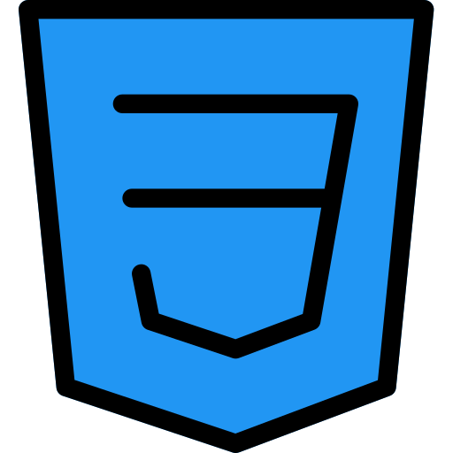
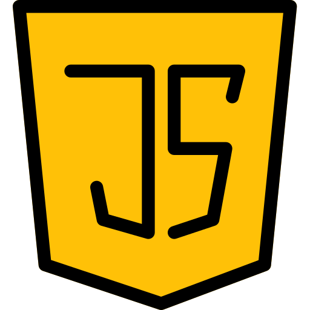

#  Hi there

My name is Nikita Pomazkin!
 
I am Web Developer with a year of work experience and around two years of hands-on programming.

---

##  Languages and Tools

HTML5, BEM

 

CSS3, SASS, Bootstrap
  

 

JavaScript, React, Vue, TypeScript

 

Webpack, Gulp

 

---

##  My Contacts

