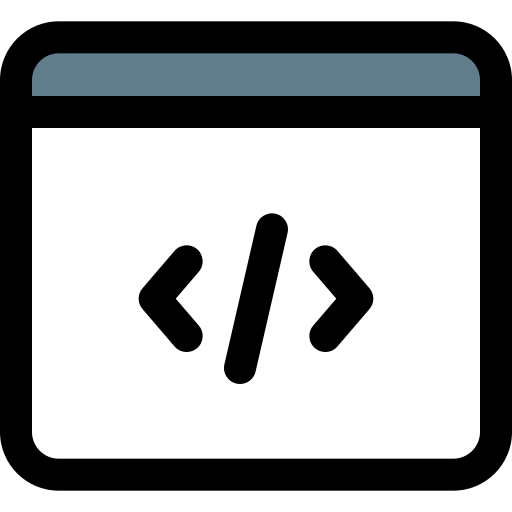

#  Hi there

My name is Nikita Pomazkin!
 
I am Web Developer with a year of work experience and around two years of hands-on programming.

##  Languages and Tools

HTML5, BEM
 

CSS3, SASS, Bootstrap
 

JavaScript, jQuery, React, Vue, TypeScript
 

Webpack, Gulp
 

##  My Contacts

